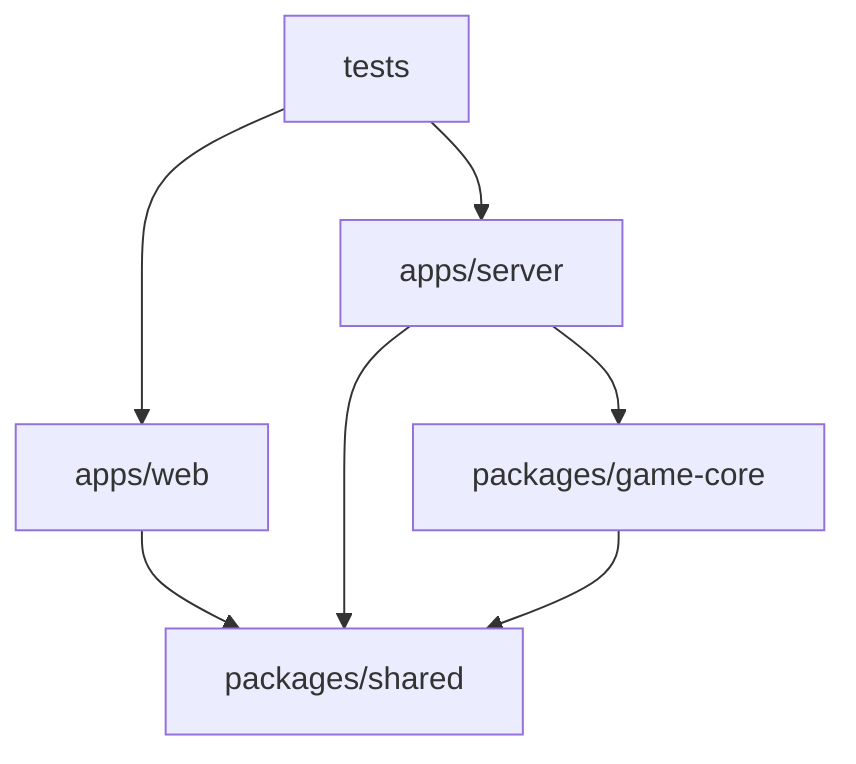

# 저장소 구조

> 문서 상태: CURRENT

이 저장소는 실행 가능한 앱, 재사용 패키지, 시스템 테스트, 문서를 최상위 경계로 분리한다. 웹과 서버는 공유 계약과 순수 게임 코어에만 의존하며, 패키지는 앱을 역참조하지 않는다.

## 디렉터리 트리

- `apps/`
  - `web/`: React·Vite·Apps in Toss 클라이언트
    - `src/app/`: 앱 조합과 최상위 화면
    - `src/config/`: 런타임 환경 해석
    - `src/features/game/`: 게임 UI, 훅, 화면 모델, 퍼즐 카탈로그
    - `src/assets/puzzles/`: 실제 배포되는 WebP 문제 이미지
    - `src/styles/`: 전역 스타일과 테마
  - `server/`: Fastify·Socket.IO 서버
    - `src/config/`: 서버 환경 설정
    - `src/game/`: 서버 권한 퍼즐 카탈로그
    - `src/observability/`: 운영 로그
    - `src/persistence/`: 메모리·PostgreSQL 저장소
    - `src/sessions/`: 게스트 세션
    - `test/unit/`: 서버 모듈 단위 테스트
    - `test/integration/`: 서버 프로세스·저장소 통합 테스트
- `packages/`
  - `shared/`: 게임 설정·공유 타입·Socket.IO 계약·에셋 매니페스트
  - `game-core/`: 좌표 판정·점수·경기 상태 머신
    - `test/`: 순수 게임 규칙 단위 테스트
- `tests/e2e/`: 웹과 서버를 함께 실행하는 Playwright 시스템 테스트
- `docs/`
  - 현재 게임·기술·화면·배포 명세
  - `design/`: 설계 참고 자료
  - `history/`: 날짜별 변경 기록과 폐기된 자료
- `scripts/`: 저장소 경계 검사

## 의존 방향

허용되는 방향은 위 화살표뿐이다. 특히 `packages/`에서 `apps/`를 import하거나 `game-core` 내부 모듈이 배럴 파일인 `index.ts`를 역참조하면 안 된다.

## 배치 원칙

| 변경 대상 | 위치 | 이유 |
|---|---|---|
| 웹 화면·상태 훅 | `apps/web/src/features/game/` | 기능 단위로 변경 범위를 모은다 |
| 웹 전용 이미지 | `apps/web/src/assets/puzzles/` | 빌드 입력만 실행 앱 가까이에 둔다 |
| 서버 저장 구현 | `apps/server/src/persistence/` | 게임 규칙과 인프라를 분리한다 |
| 공유 네트워크 계약 | `packages/shared/src/protocol/` | 웹·서버 타입 불일치를 막는다 |
| 순수 판정 로직 | `packages/game-core/src/` | 프레임워크 없이 단위 테스트한다 |
| 패키지 단위·통합 테스트 | 각 패키지의 `test/` 또는 구현 옆 `*.test.ts` | 패키지가 독립적으로 검사되고 변경 소유권이 드러난다 |
| 앱 전체 브라우저 테스트 | `tests/e2e/` | 웹·서버 어느 한쪽에도 소유되지 않는 시스템 검증이다 |
| 과거 변경 기록 | `docs/history/` | 현재 명세와 검색 결과가 섞이지 않게 한다 |
| 생성된 `*.ait` | GitHub Actions artifact | 재생성 가능한 바이너리를 소스에 넣지 않는다 |

## 구조 검사

`pnpm check`는 타입 검사 전에 `scripts/check-repository-structure.mjs`를 실행한다. 예전 `UI/`, 최상위 `e2e/`, 임시 payload, 서버 `src` 내부 테스트, 생성된 `*.ait`가 다시 들어오면 실패한다. 테스트 배치의 상세 결정은 [테스트 구조](TEST_STRUCTURE.md)를 따른다.
