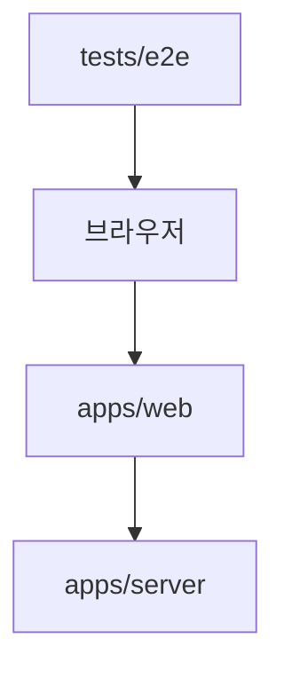

# 테스트 구조와 배치 결정

> 문서 상태: CURRENT
> 기준일: 2026-09-04

이 문서는 테스트의 **검증 범위**, **실행 주체**, **소유 패키지**를 기준으로 저장 위치를 정한다. 결론은 모든 테스트를 루트에 집중하지 않고, 패키지 테스트는 해당 패키지에 두며 여러 앱을 함께 검증하는 E2E만 루트 `tests/e2e/`에 두는 혼합 구조다.

## 현재 구조

```text
apps/
├─ web/
│  └─ src/
│     ├─ config/*.test.ts
│     └─ features/game/**/*.test.ts
└─ server/
   └─ test/
      ├─ unit/*.test.ts
      └─ integration/*.integration.test.ts
packages/
└─ game-core/
   └─ test/*.test.ts
tests/
└─ e2e/*.spec.ts
```

| 계층 | 위치 | 실행기 | 검증 범위 |
|---|---|---|---|
| 웹 단위 테스트 | `apps/web/src/**/*.test.ts` | Vitest | 설정, 화면 모델, 좌표 변환, 퍼즐 카탈로그 |
| 서버 단위 테스트 | `apps/server/test/unit/` | Vitest | 세션, 경기 레지스트리, 저장소, 로그, Origin 처리 |
| 서버 통합 테스트 | `apps/server/test/integration/` | Vitest | Fastify·Socket.IO·PostgreSQL·정적 웹 연동 |
| 게임 코어 단위 테스트 | `packages/game-core/test/` | Vitest | 좌표 판정, 점수, 경기 상태 머신 |
| 시스템 E2E | `tests/e2e/` | Playwright | 실제 웹과 서버를 함께 띄운 사용자 흐름·접근성 |

## 서버 테스트를 `src` 밖에 둔 이유

서버의 `src/`는 배포되는 런타임 코드만 담는 경계다. 테스트를 `src`에 섞으면 다음 문제가 생긴다.

1. 빌드 설정과 테스트 설정의 책임이 섞인다. 서버 배포 빌드는 `tsconfig.build.json`의 `src`만 컴파일하지만, 개발용 타입 검사는 `src`와 `test`를 함께 검사한다.
2. 런타임 탐색과 리팩터링에서 테스트 헬퍼가 운영 모듈처럼 보인다.
3. 통합 테스트가 여는 포트, 임시 저장소, PostgreSQL 연결 같은 실행 환경이 애플리케이션 코드와 같은 계층에 노출된다.

따라서 `apps/server/test/unit`과 `apps/server/test/integration`을 분리했다. 서버 패키지 안에 있기 때문에 `pnpm --filter @spot-battle/server test`로 독립 실행할 수 있고, `src` 밖이기 때문에 배포 산출물에는 포함되지 않는다.

## 모든 테스트를 루트로 모으지 않는 이유

루트 `tests/` 하나만 보면 파일을 찾기는 쉽지만, 이 저장소에서는 비용이 더 크다.

| 판단 기준 | 전부 루트 배치 | 현재 혼합 배치 |
|---|---|---|
| 테스트 검색 | 한 디렉터리에서 찾기 쉬움 | 이름 검색 또는 패키지별 탐색 필요 |
| 패키지 독립 실행 | 루트 Vitest 설정에 의존 | 각 패키지 명령으로 독립 실행 가능 |
| 변경 소유권 | 경로만으로 대상 패키지가 덜 명확 | 테스트와 소유 코드의 경계가 일치 |
| import 경로 | 길어지거나 별도 alias 필요 | 패키지 내부 상대 경로가 짧음 |
| 설정 복잡도 | 루트에 Node·웹·통합 환경을 합쳐야 함 | 각 패키지가 필요한 환경만 소유 |
| 패키지 분리·재사용 | 테스트 이동과 설정 재작성 필요 | 패키지 디렉터리째 이동 가능 |

특히 현재 루트 `pnpm test`는 워크스페이스 각 패키지의 `test` 스크립트를 실행한다. 테스트를 전부 루트로 옮기면 이 모델을 버리고 루트 Vitest 프로젝트 설정, 패키지별 include, 타입 설정, alias를 새로 관리해야 한다. 파일 위치를 한곳으로 모으는 이점보다 실행 경계가 약해지는 손실이 크다.

## 배치 규칙

1. 한 모듈의 순수 동작을 검증하면 그 모듈을 소유한 패키지에 둔다.
2. 서버 프로세스나 저장소 경계를 넘으면 `apps/server/test/integration/`에 둔다.
3. 웹·서버를 동시에 실행해야 하면 `tests/e2e/`에 둔다.
4. Playwright 파일은 `*.spec.ts`, Vitest 파일은 `*.test.ts` 또는 `*.integration.test.ts`를 사용한다.
5. 테스트 전용 헬퍼가 한 패키지에서만 쓰이면 해당 패키지의 `test/helpers/`에 둔다. 여러 패키지에서 공유하게 되면 별도 테스트 유틸 패키지의 필요성을 다시 평가한다.
6. 운영 서버 코드인 `apps/server/src/`에는 테스트 파일을 두지 않는다. `pnpm check:structure`가 이 규칙을 검사한다.

## 루트 `tests/`의 책임

루트 테스트는 패키지 테스트의 집합이 아니라 **저장소 전체를 하나의 제품으로 검증하는 계층**이다. 현재는 Playwright가 다음 두 프로세스를 시작한 뒤 실제 브라우저에서 검증한다.



따라서 접근성, 2인 매칭, 실시간 진행처럼 앱 경계를 가로지르는 시나리오만 이 위치에 추가한다. 서버 레지스트리나 게임 코어 계산처럼 단일 패키지에서 끝나는 검증은 루트로 올리지 않는다.

## 실행 명령

```bash
# 구조·타입 검사
pnpm check

# 모든 패키지의 Vitest 테스트
pnpm test

# 웹과 서버를 띄우는 Playwright E2E
pnpm e2e

# 특정 패키지만 검사
pnpm --filter @spot-battle/server test
pnpm --filter @spot-battle/game-core test
```

## 재검토 조건

다음 조건 중 하나가 생기면 루트 집중형 구조나 별도 테스트 워크스페이스를 다시 검토한다.

- 여러 패키지를 동시에 import하는 Vitest 통합 테스트가 크게 늘어난다.
- 패키지별 실행보다 테스트 종류별 병렬 실행이 CI 시간을 유의미하게 줄인다.
- 공통 fixture와 mock이 세 패키지 이상에서 반복된다.
- 테스트를 별도 배포·검증 프로젝트로 운영해야 한다.

그 전까지는 패키지 소유 테스트와 제품 전체 E2E를 분리하는 현재 구조를 유지한다.
